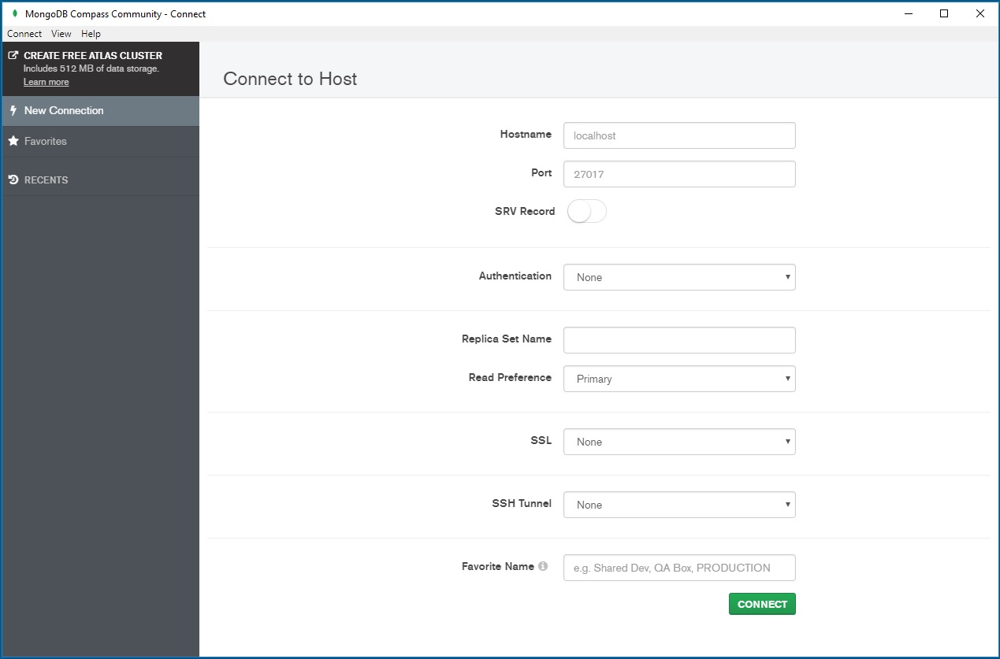

## MongoDB Concepts:

| RelationalDB Concept | MongoDB Equivalent |
| --- | --- |
| Database | Database |
| Tables | Collections |
| Rows | Documents |
| Index | Index |

### Example of Document:
```python
{
    first_name: 'Paul',     #String
    last_name: 'Miller',    #String
    cell: 44123456789,      #Number
    city: 'London',
    location: [45.123, 47.232],     #Geo-Coordinates
    profession: ['banking','finance','trader'],     #Fields can contain Arrays
    cars: [ 
        {   model: 'Bentley',       #Fields can contain an array of sub-documents
            year: 1973,
            value: 10000
        }
        {
            model: 'Rolls Royce',
            year: 1965,
            value: 33000
        }
    ]

}
```


### MongoDB - Compass:

The GUI for MongoDB, to visually explore your data.

